# Computer Networking

> How computers communicate with each other - A course ([The bits and bytes of computer networking - coursera](https://www.coursera.org/learn/computer-networking/home/welcome)) note 

### TCP/IP Five-Layer Network Model

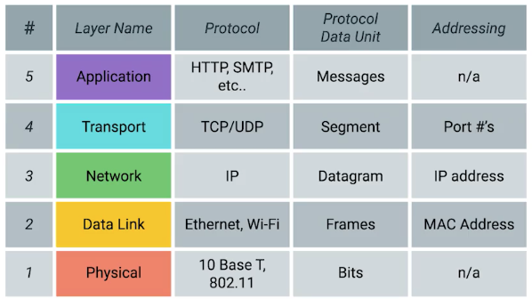

- Physical layer
  - represent the physical devices that interconnect computers
  - specifications for cable, sending signals
- Data Link
  - defining a common way of interpreting these signals so network devices can communicate
  - protocol: Ethernet - getting data to node on the same network or link
- Network
  - allow different devices to communicate with each other through devices known as routers
  - get data across networks, links
  - IP 
- Transport
  - sorts out which client or server to send or receive data
  - TCP - reliable, UDP - not reliable
- Application
  - application specific protocols

### The Basics of Networking Devices

#### Cables

- copper
  - electrical voltages - 0/1
  - Cat5, Cat5e, Cat6 - how twisted pairs are arranged inside them can affect how quickly data can be sent and how resistant these signals are to outside interference.
  - Crosstalk - when an electrical pulse on one wire is accidentally detected on another wire. 
  - cat5e, cat6 - more strict specifications to reduce crosstalk
  - cat6 -  more reliable and faster, but shorter distance  
- fiber
  - pulses of light - 0/1
  - resistant to electronmagnetic interference, faster, but fragile

#### Hubs and Switches

- single network - LAN

- hub - ```a physical layer device``` that allows for connections from many computers at once
  - broadcast
  - collision domain - a network segment where only one device can communicate at a time because electrical pulses will interfere with each other
- switch - `a data link layer device` that allows for connections from many computers at once
  - only send data to intended system

#### Routers

- a device that forward data between independent networks
- `a network layer device`
- home/office LAN - ISP (core router) - internet
- BGP(*Border Gateway Protocol*) - routers share data with each other via this protocol, which lets them learn about most optimal paths to forward traffic

#### Servers and Clients

- nodes - devices that can communicate with each other
- server - provide data (a node or an applicaiton inside a node)
- client - receive data
- a node can be a server or a client or both, eg. email server is a server but also a client to DNS server

### The Physical Layer

#### Moving Bits Across the Wire

- sending 0/1 bits
- modulation / line coding - a way of varying the voltage of this charge moving across the cable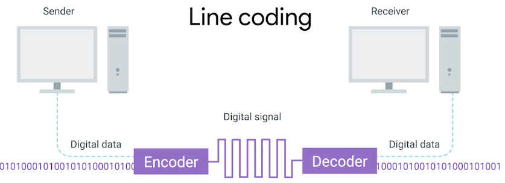

#### Twisted Pair Cabling and Duplexing

- pairs of twisted copper wires 
- cat 6 - standard 4 twisted pair per jacket 
- duplex communication - information can flow in both directions across the cable
  - reserving some pairs for one direction and some pairs for another
  - full-duplex - simultanneous bidirectional communicaiton
  - half-duplex - take turns
- simplex - unidirectinoal

#### Network Ports and Patch Panels

- most common - RJ-45 (*Registered jack 45*) 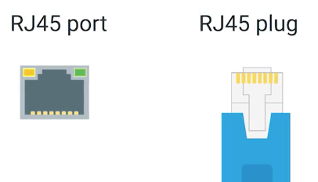 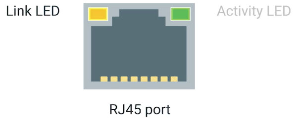
- Network ports - are generally directly attached to the devices that make up a computer network
- Patch Panel - a device that only has many network ports


### The Data Link Layer

> Abstract away the need for any other layers to care about the physical layer and what hardware is in use

#### Ethernet and MAC Address

- CSMA/CD - used to determine when the communications channels are clear, and when a device is free to transmit data
  - a node can send data if it detects no devices are sending data 
  - wait random intervals if more than one devices are sending data, which resulted in a collision
- MAC (`media access control`) address 
  - global unique identifier attached to an individual network interface
  - 48-bit number -  6 groupings of 2 hex
  - two sections - OUI + Vendor Assigned, 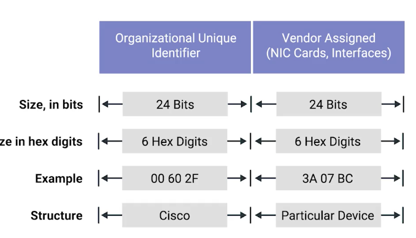
  - Ethernet uses MAC to specify sender and receiver

#### Unicast, Multicast, and BroadCast

- a `unicast` transmission is alwasy meant for just one receiving address
  - if th least significant bit in the first octet of a destination address is set to <u>zero</u>, it means that ethernet frame is intended for only the destination address
  - e.g. 00:01:44:55:66:77 -> `00` which is `0000 0000`, the rightmost bit is `0`
- `multicast` - send to all devices BUT will be accpeted or discarded by each device depending on criteria from their own MAC address, eg. networks interfaces can be configured to accept a list of configured multicast addresses
  - if th least significant bit in the first octet of a destination address is set to <u>one</u>, it means that ethernet frame is intended for only the destination address
  - e.g.  01:00:CC:CC:DD:DD -> `01` is the first octet, convert it to binary `0000 0001` the rightmost bit is 1 
- `broadcast` - send to every single device on a LAN
  - ip broadcast address 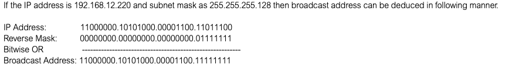 (reverse mask = ~subnet mask)
  - broadcast mac address: FF:FF:FF:FF:FF:FF

#### Dissecting an Ethernet Frame

- `data packet` : an all-encompassing term that represents any single set of binary data being sent across a network link
- ethernet frames - data packet at ethernet level
  - 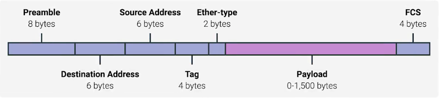
  - Preamble
    - first 7 bytes - act as a buffer between frames and can also be used to synchronize the internal clock the network interfaces use
    - last byte - SFD - start frame delimiter - signal to a reveving device that the preamble is over and actual frame contents will now follow
  - Destination MAC address 
  - Source MAC address
  - EtherType field 
    - VLAN (`Virtual LAN`) Tag
      - a technique that lets you have multiple logical LANs operating on the same physical equipment
      - indicate that the frame itself is a VLAN frame
      - will only be delivered out of a switch that configured to relay that specific tag
    - Ether-type - 16 bits long and used to describe the protocol of the contents of the frame
  - Payload
    - actual data - 46 to 1500 bytes long
    - all data from upper layers
  - Frame Check Sequence - a 4 byte number that represents a checksum value for the entire frame
    - CRC(`Cyclical Redundancy Check`)

### The Network Layer

> Allow data to cross many networks facilitating communications over great distances

#### IP Adress

- 32  bit  - 4 octet
- belong to networks not attached to devices
- DHCP - Dynamic Host Configuration Protocol - aumatically assign ip address

#### IP Datagrams and Encapsulation

- IP header datagram 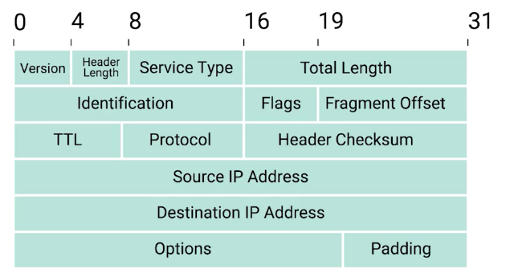  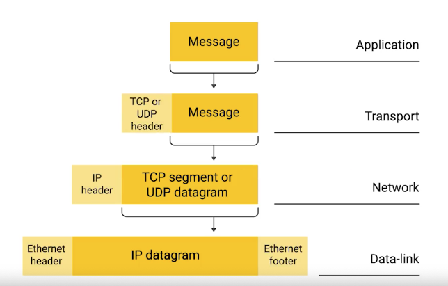
- Version - what version of internet protocol, e.g. IPv4
- Header Length - lenght of the header
  - almost always 20 bytes for IPv4
  - 20 bytes is the min length for a ip header
- Service Type - details about quality of service, Qos
- Total Length - total length the IP datagram
- Identification - group message together
  - max size of a single datagram is 2^16 - 1 = 65535 bytes
  - large amount of data will be divided into smaller packets to fit in the max size
  - packets with the same identification will be identified by the receiver as a part of the same transmission
- Flags
  - to indicate if the datagram is fragmented or not
  - Fragmentation - talking a single IP datagram and splitting it up into several smaller datagrams
- Fragment offset - help to put all fragments back together
- TTL - time to live - how many router hops a datagram can traverse before it's thrown away
- Protocol - transport layer protocol
- Header Checksum 
- Source IP Address
- Dest IP - Address
- Options - set special characteristics for datagrams primarily used for testing purposes
- Padding - a series of zeros

#### IP Address Classes

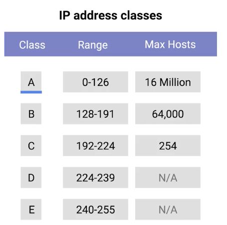  *class c ends with 223* not 224

- Class A
  - first octet is the network ID, and last three are used for host ID
  - starts with 0
- Class B
  - first two octet are network ID
  - starts with 10
- Class C
  - first 2 octet are network ID
  - starts with 110
- Class D
  - starts with 1110
  - used for multicasting
- Class E
  - unassigned
  - testing 

#### Address Resolution Protocol - ARP

- discover the hardware address of a node with a certain IP address
- look at the local ARP table
-  if not found, send broadcast ARP message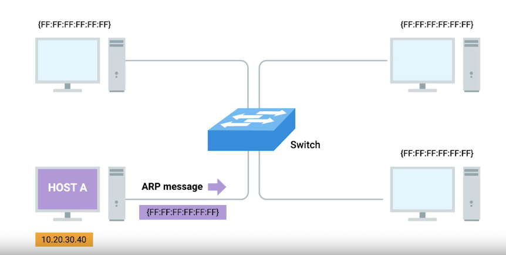
-  receive the ARP response containing the MAC address

### Subnetting

#### Subnetting

- A gateway router - entry / exit of a network
- split a large network into smaller ones

#### Subnet Masks

- subnet ID - part of host ID
- 32 bits
- 9.100.100.100 - 0000 1001   0110 0100   0110 0100   0110 0100 -  IP address
- 255.255.255.0 - 1111 1111  1111 1111   1111 1111   0000 0000 - subnet mask - a subnet of 256 ip addresses, but normally 254 (1-254) hosts, as 0 is not used, and 255 is reserved for broadcast
- another notation, 9.100.100.100/24 - 24 means all first 24 bits are used as a 'network ID (Class A network ID + sub network ID)' - which indicates that the submask should have all first 24 bits of 1s and left are 0s
- a subnet mask: all `1s`  tells use what part we can ignore to compute a host ID, follows all `0s`tell us what to keep
- (class network + sub network) network ID  = (IP) & (Subnet mask)

#### CIDR - Classes Inter-Domain Routing

- Demarcation point - to describe where one network or system ends and another one begins
- CIDR notation:  9.100.100.100/24
- more flexiable network sizes 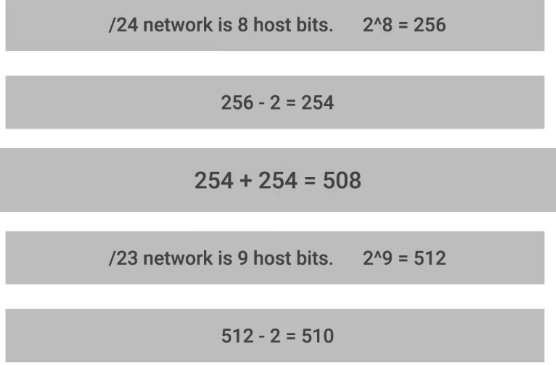

### Routing

#### Basic Routing Concepts

- router - a device with two network interfaces (because it connects with two networks) that forward traffic depending on the destination address
- 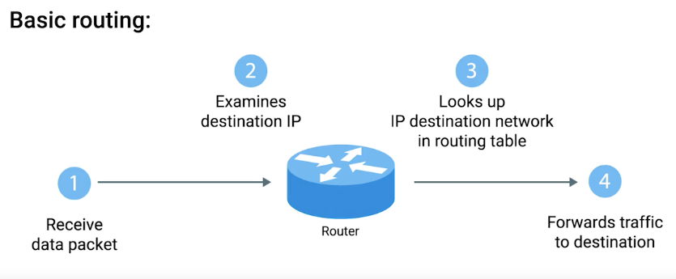
- 
- A node network A 192.169.1.100 sends packet to  node B 10.0.0.10
  1. source MAC: MAC A ,  destination MAC: MAC of router, send packet to router
  2. router look at the routing table,  decrement the TTL 
  3. soruce MAC: MAC of router, destination MAC: MAC B, send packet to B

#### Routing Tables

- destination network - CIDR or IP with subnet masks
- Next hop - next router ip or state no additional hops needed
- Total hops - shortest path
- Interface - which interface to go out

#### Interior Gateway Protocols

- routers share information within a single autonomous system
  - autonomous system: a collection of networks that all fall under the control of a single network operator
- distance-vector protocol
  - a router sends its routing table to every neighbouring router
  - 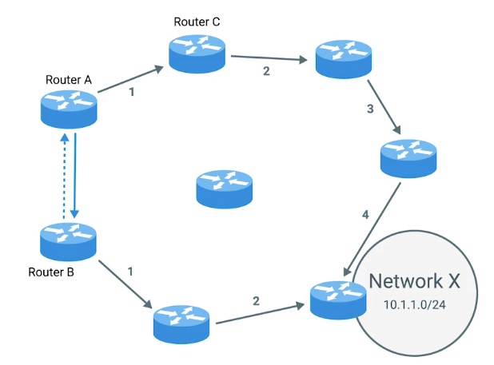
    - at the beginning, a path for A to X is 1-2-3-4
    - B shares its routing table to A
    - A finds out from B to X is 2 hops away, it's still shorter adding the path from A to B
    - A adjust its path to X, A -> B -> 1-> 2
    - cons: react slowly to the changes of networks far away itself
  - link state routing protocol
    - 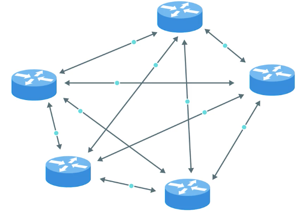
    - each router shares its info of each of its interface
    - information about each router is propagated to every other router in the autonomous system
    - each router runs complicated algorithms to determine the best path

#### Exterior Gateway Protocols

- IANA (`Internet Assigned Numbers Authority`): A non-profit organization that helps manage things like IP address allocation
  - also response for ASN (`Autonomous System Number`) allocation
    - ASN: 32 bits  - IBM: AS19604 - 9.0.0.0/8 
    - core routers(ISP) update ASN to find Autonomous system

#### Non-Routable Address Space

- RFC (`Request for Comments`)
- Exterior Gateway Protocols will not route those addresses, but Interior Gateway Protocols can route those address so they can be used within an autonomous system
- 10.0.0.0/8
- 172.16.0.0/12
- 192.168.0.0/16

### The Transport Layer

> Allow traffic to be directed to specific network applications

#### Transport Layer

- multiplexing - nodes on the network have the ability to direct traffic toward many different receiving services.
- demultiplexing - take traffic that's all aimed at the same node and delivering it to the proper receiving service.
- port - 16-bit number that used to direct traffic to specific services running on a netwroked computer
  - socket address/socket number - ip:port e.g. 10.0.0.100:80

#### Dissection of a TCP Segment

- TCP segment = TCP header + data section(payload from appication layer)
- 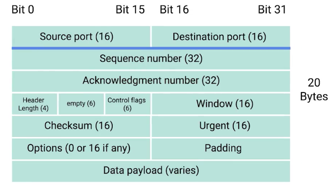
- Source Port - a high numbered port chosen from a special section of ports known as ephemeral ports
- Destination Port
- Sequence number - used to keep track of where in a sequence of TCP segments this one is expected to be
- Acknowledgement number - the number of next expected segment
- Header length - length of this tcp header so the receiving ends knows where the payloads start
  - measured in 32-bit multiples
  - e.g. the value is 7(0111), the length of header is 7 * 32 / 8 = 28 bytes
- Control flags
- Window - specifies the range of sequence numbers that might be sent before an acknowledgement is required
- Checksum
- Urgent - used in conjunction with one of the tcp control flags to point out particular segments that might be more important than others
- Options - sometimes used for more complicated protocols
- Padding

#### TCP Control Flags and the Three-way Handshake

- URG(urgent) - A value of `1` here indicates that the segment is considered urgent and the urgent pointer field more has data about this
- ACK(acknowledgement) - A value of `1` in this field means that the acknowledgement number field should be examined
- PSH(push) - The transmitting device want s the receiving device to push currently-buffered data to the application on the receiving end as soon as possible
- RST(reset) - one of the sides in a tcp connection hasn't been able to properly recover from a series of missing or malformed segment
- SYN - it's used when first establishing a tcp connection and makes sure the receiving end knows to examine the sequence number field
- FIN(finish) - `1`means transmitting computer doesn't have any more data to send and the connection can be closed.
- establish conection: Three-Way Handshake 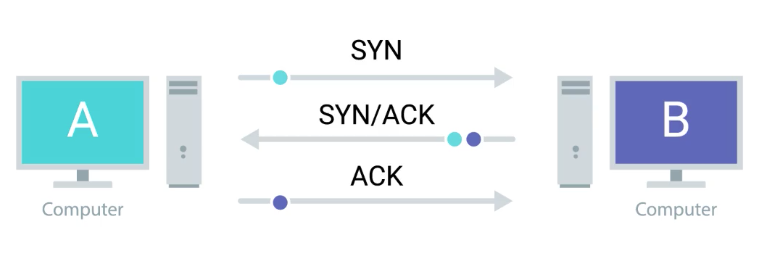
  - A sends SYN (seq = x)
  - B receives SYN (seq = x) and responses ACK and SYN (seq = y, ack = x + 1)
  - A receives and sends ACK(ack=y+1)
- close connection: Four-Way Handshake 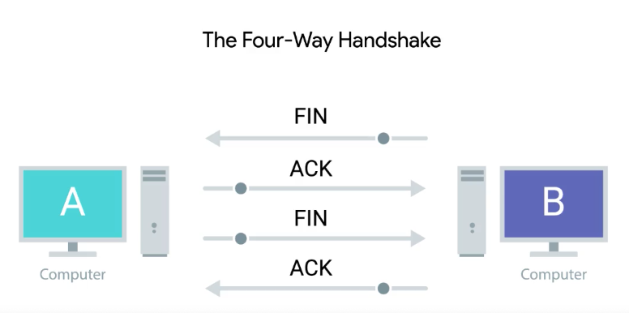
  - 

#### TCP Socket States

- a socket is the instaniation of an endpoint in a potential TCP connection
- LISTEN - a TCP socket is ready and listening for incoming connections (server side)
- SYN-SENT - a synchronized request has been sent, but the connection hasn't been established yet (client side)
- SYN-RECEIVED - a socket previously in a LISTEN state has received a synchronization request and sent a SYN/ACK back (server side)
- ESTABLISHED - The TCP connection is in working order and both side are free to send each other data (both sides)
- FIN_WAIT - a FIN has been sent, but the corresponding ACK from the other end hasn't been received yet (both sides)
- CLOSE_WAIT - the connection has been closed at the TCP layer, but that the application that opened the socket hasn't released its hold on the socket yet
- CLOSED - connecton fully terminated
- socket state definitions can vary from system to system

#### Connection-oriented and Connectionless Protocols

- connection-oriented
  - tcp
  - reliable, but having overhead of establishment, ackownledgement of data segments and tire down of the connection
- connectionless 
  - UDP
  - streaming videos
  - doesn't resent lost data, doesn't ensure sequence

#### Firewalls

- most commonly used at Transportation Layer, could be used at other layers
- blocking or allowing traffic through certain ports

### The Application Layer

> Allows applications to communicate in a way they understand

#### The Application Layer and the OSI Model

- 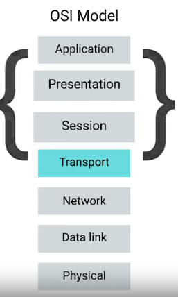
- Session Layer - facilitating the communication between actual applications and the transport layer
- Presentation Layer - responsible for making sure that the unencapsulated applicaiton layer data is able to be understood by the application in question

#### All the Layer Working in Union

- 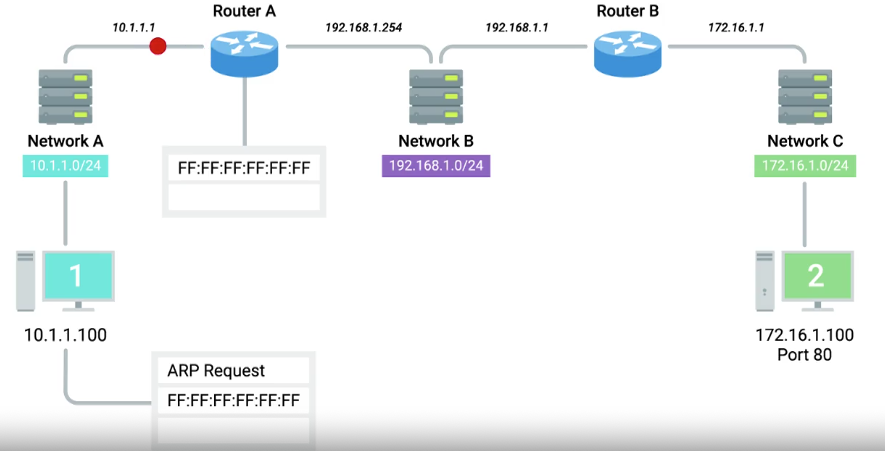 computer 1 find out the destination is not in its network, it tries to reach the gateway router A, which it has been configured with(it knows the ip of the gateway), but faild to find the mac (needed to contruct the ethernet frame) on local ARP table, so it broadcasts a ARP request
- 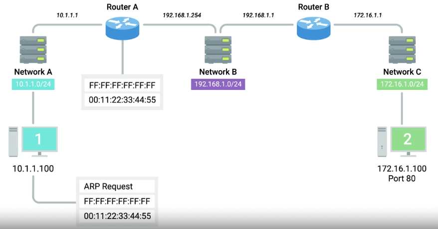  the router recognizes the ip as its own, and responses with its MAC address
- 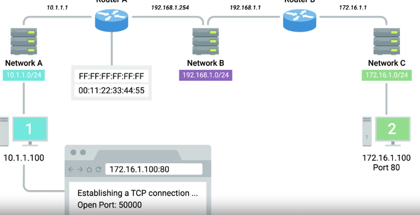 Computer 1 open an ephemeral port for browser
- 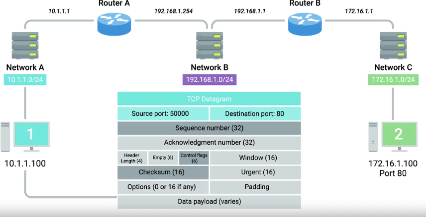 construct tcp segment
- 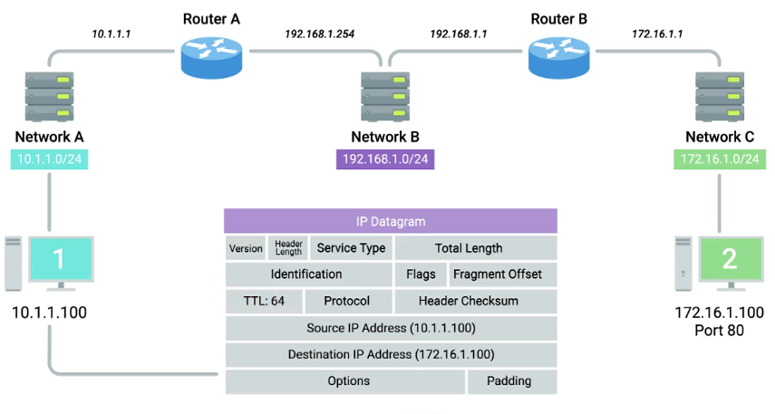 contruct ip datagram
- 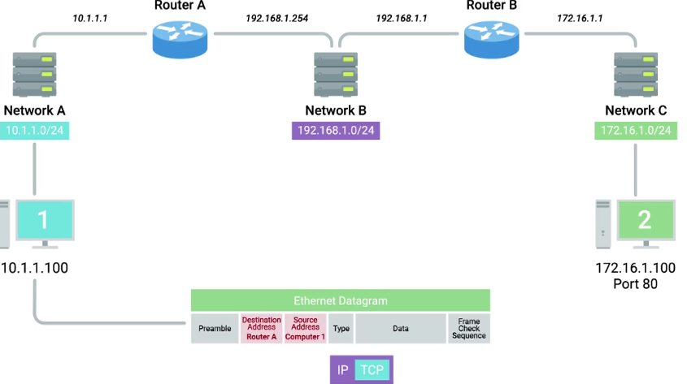 contruct ethernet frame
- 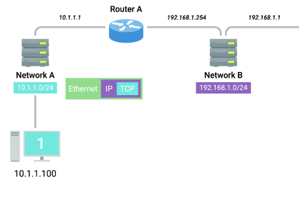 sends out as modulaiton of 0/1 to physical link, the switches will ensure it gets sent out of the interface that the router A connectd to

### Name Resolution

#### Why do we need DNS?

- Domain Name System(DNS) - a gloabl and highly distributed network service that resolves strings of letters into IP addresses for you
- Domain Name - something that can be resolved by DNS
  - www.google.com 
  - the actual ip could change - distributed servers

#### The Many Steps of Name Resolution

- Five primary types of DNS servers
  1. Caching name servers - store domain name lookups for a certain amount of time (TTL)
  2. Recursive name servers - store domain name lookups for a certain amout of time, <u>full  recursive DNS lookup</u> then could cache it.
     1. contact a root named server, there are 13 total root name servers which are responsible for directing queries toward the appropriate TLD name server.
        1. root name servers are distributed globe via anycast
        2. Anycast: a technique that's used to route traffic to different destination depending on factors like location, congestion, or link health
     2. a root name server will response with a TLD name server
     3. TLD server with a redirect
     4. lookup autoritative name servers
  3. Root name servers
  4. TLD (top level domain, such as .com) name servers
  5. Authoritative name servers

#### DNS and UDP

- DNS is great example of an application layer service that uses UDP for the tranport layer intead of TCP
- assuming using tcp 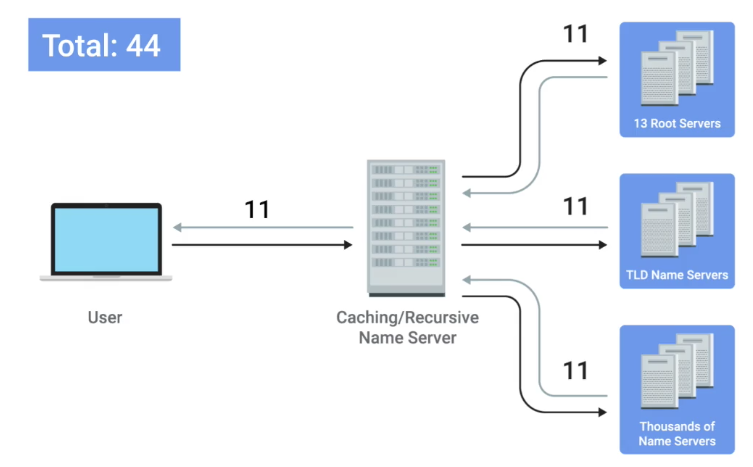 44 packets need to be sent.
  - 11 = establishment(3 way handshake) + request + ack of request + response + ack of response + tiredown (4)
- using UDP 
  - in case of error recovery, the dns resolver will ask again if it didn't get any response
  - if a response is too large to fit in a UDP datagram, a tcp connection will be established.

### Name Resolution in Practice

#### Resource Record Types

- `A record` - used to point a certain domain name at a certain IPv4 IP address
  - DNS round robin - blance traffic across multiple IPs (implemented with multiple `A record`) bound with a domain name
  - e.g.  4 `A record` for `microsoft.com` : `10.1.1.1` `10.1.1.2` `10.1.1.3` `10.1.1.4`
    - first computer that performs a lookup will receive all four IPs (in case a connection fails) in order of 1, 2, 3, 4 
    - next computer that ... will all receive 4 IPs but in order of 2, 3, 4, 1
- `AAAA record` - IPv6 address
- `CNAME` - redirect traffic from one domain to another
- `MX` - mail exchange
- `SRV` - service record
- `TXT` - text record

#### Anatomy of a Domain Name

- www.google.com
- Top Level Domain(TLD) - `.com` - ICANN ( the Internet Corporation for Assigned Names and Numbers)
- Domains - `google` - used to demarcate where control moves from a TLD name server to an authoritative
  - it costs money to register a domain
- subdomain - `www` - sub domain can be freely chosen or assigned by the one who controls a registered domain
- Fully qualified domain name (FQDN) = TLD + domain + subdomain
  - each section can only be up to `63` character, and FQDN is limited to` 255 `characters
- DNS can technically support up to `127` levels of domain in total for a single fully qualified domain name
  - a.b.c.d.e.f.c.d.google.com

#### DNS Zones

- an authoritative name server is actually responsible for a specific DNS zone
- allow for easy control over multiple levels of domain
  - eg. root servers covering the root zone, a TLD server convers its specific TLD zone
  - zones don't overlap
- zone file - simple configuration files that declare all resource records for a particular zone
  - Start of authority(SOA) records - declares the zone and the name of the name server that is authoritative for it
  - NS records - indicate other name servers that might also be responsible for this zone
  - Reverse lookup zone files - let DNS resolvers ask for an IP AND GET THE FQDN associated with it returned

### Dynamic Host Configuration Protocol

#### Overview of DHCP

- every computer on a TCP/IP based network needs
  - IP address + subnet mask + primary Gateway + Name server
- An application layer protocol that automates the configuration process of hosts on a network
  - while it's important to have a static IP for some devices like the gateway router in your network, it doesn't matter which ip your client devices have as long as they have a unique one
- Dynamic allocation - A range of IP address is set aside for client devices and one oof these IPs is issued to these devices when they request one
  - the DHCP server will try to keep track of which ip is assigned to which device in order to assign the same ip to the same device each time if possible
  - Automatic allocation - a range of IP addresses is set aside for assignment purposes
- Fixed allocation - requires a manually specified list of MAC address and their corresponding IPs
  - for security -  only devices have bee configured on the DHCP server with a ip address will have access to the network
- Network time protocol (NTP)  servers - used to keep all computers on a network synchronized in time

#### DHCP in Action

- DHCP discovery - the process by which a client configured to use DHCP attempts to get network configuration information
  - DHCP client broadcast (from UDP port 68) a DHCP discovery message to the network - DHCP server listens on UDP port 67.         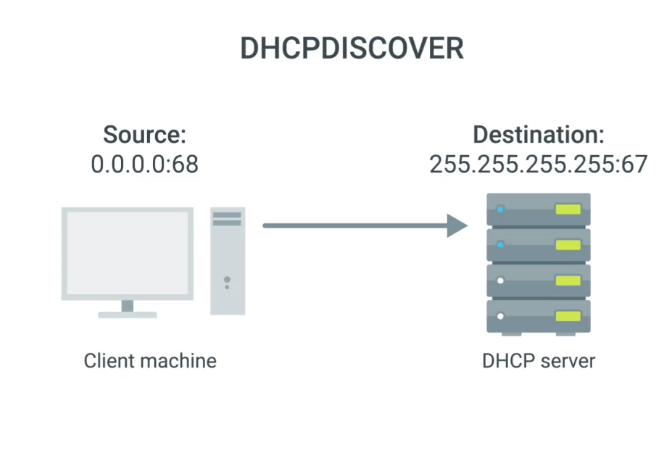
  - DHCPOFFER - the DHCP server will exam its configuration and decide which ip address to return , and broadcast a offer message 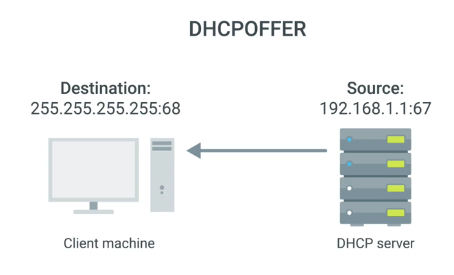
  - the intended client will recognized this message because the DHCPOFFER message will specify the MAC address of the client
  - the DHCP client selects one server and broadcasts a request message  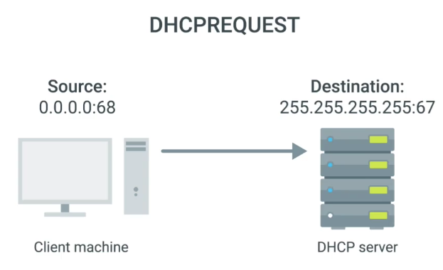
  -  DHCP server responses with an ack message  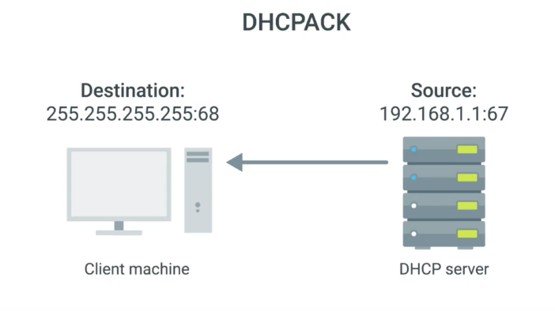
  - the client can now use the configuration information(ip, subnet mask, gateway ip, dns server, lease time) presented by the server to configure its network layer
- [addtional reference](https://www.netmanias.com/en/post/techdocs/5998/dhcp-network-protocol/understanding-the-basic-operations-of-dhcp)   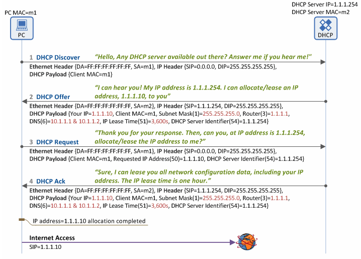


### Network Address Translation

#### Basics of NAT

- a technology that allows a gateway, usually a router or firewall, to rewrite the source IP of an outgoing IP datagram while retaining the original IP in order to rewrite it into the response
- 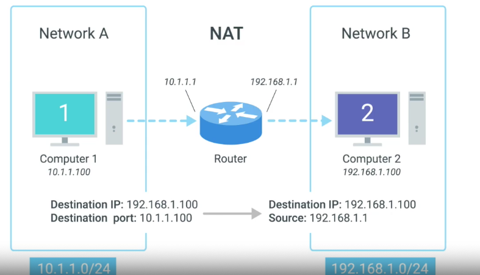

#### NAT and the Transport Layer

- Port preservation - a technique where the source port chosen by a client is the same port used by the router
- 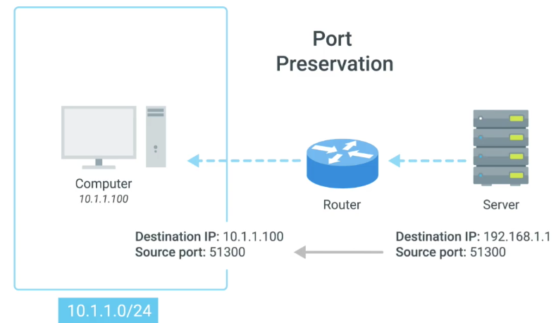 if two devices on the network chose the same port, the rotuer normally chooses a random unused port
- Port forwarding - a technique where specific destination ports can be configured to always be delivered to specific nodes

#### NAT, Non-Routable Address Space and the Limits of IPv4

- five regional internet registers (RIPs)
  - AFRINIC - Africa
  - ARIN - Unite States, Canada, parts of the Caribbean
  - APNIC - Asia, Austrillia, New Zealand and Pacific Island nations
  - LACNIC - central and south America and remaining part of Caribbean
  - RIPE - Europe, Russia, middle east and portions of middle Asia
- workaround of IPv4 exhaustion

### VPNs and Proxies

#### Virtual Private Networks

- a technology that allows for the extension of a private or local network to hosts that might not be on that local network
- 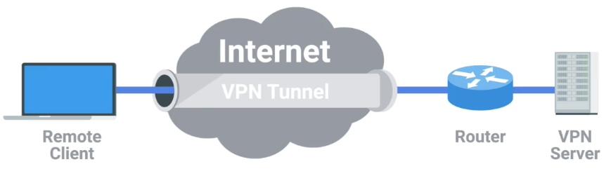 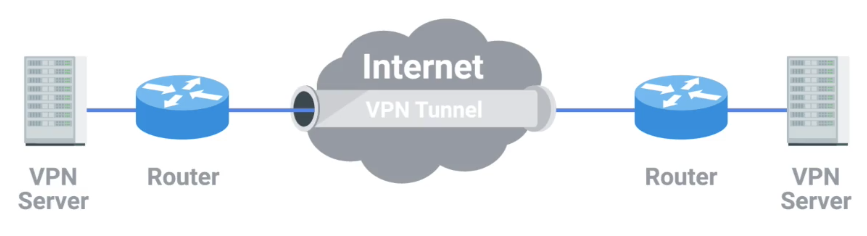
  - a VPN tunnel is established with a VPN client to the intended network
  - the client will be seen as a virtual interface with a IP that match the address space of the intended network
  - most VPN use the payload of tranport layer to carray the entire set of encrypted packets 

#### Proxy Services

- a server that acts on behalf of a client in order to access another service
  - e.g. gateway
- 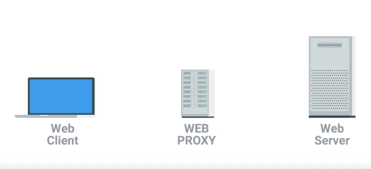
  - the web proxy server could get the web from web server and cache it to increase performance
- 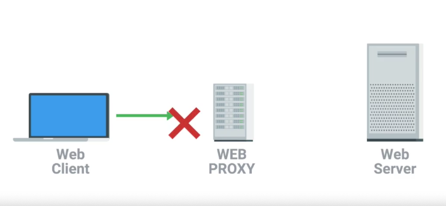
  - this proxy can filter the request
- Reverse proxy - a service that might appear to be a single server to external clients, but actually represents many servers living behind it

### POTS and Dial-up

- POTS - Plain old telephone services
- Dial-up.  
  - modem - modulator / demodulator
  - Baud rate - A measurement of how many bits can be passed across a phone line in a second

### Broadband Connections

#### What is broadband?

- any connectivity technology that isn't dial-up internet
- T-carrier - originally invented by AT&T in order to transmit multiple phone calls over a single link

#### T-Carrier Technologies

- T1
  - up to 24 simultaneous phone calls per twisted pairs of copper wire
  - each phone call channel was capable of transmitting data at 64 kb per second => each line 1.544 mb per second
- T3
  - multiplexing 28 T1 line to achieve a throughtput of 44.736 mbps

#### Digital Subscriber Line

- point to point 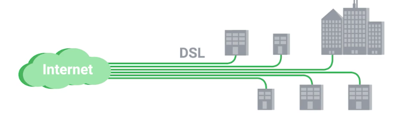
- DSL
  - operating at a frequency range that didn't interfere with normal phone calls
  - allowed for normal phone calls and data transfer to occur at the same time on the same line
- ADSL - asymmetric digital subsriber line - different speed for outbound and inbound data
- SDSL - symmetric - same upload and download speed - up cap 1.544mbps (T1)
- HDSL - high bit-rate DSL - above 1.544mbps

#### Cable Broadband

- starts with cable television
- shared bandwith technology 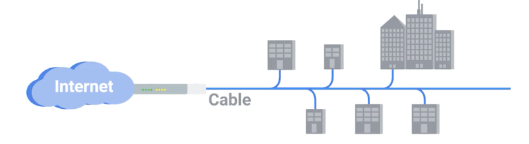
- Cable modem termination system(CMTS) - connections lots of different cable connections to an ISPs core network

#### Fiber Connections

- FTTX - Fiber to the X 
  - FTTN - Fiber to the neighbour
  - FTTB - Fiber to the building / business / basement
  - FTTH - Fiber to the Home
    - Optical Network Terminator (ONT) - converts data from protocols the fiber network can understand to those that more traditional, twisted-pair copper networks can understand

### WANs

#### Wide Area Network Technologies

- Acts like a single network, but spans across multiple physical locations
- 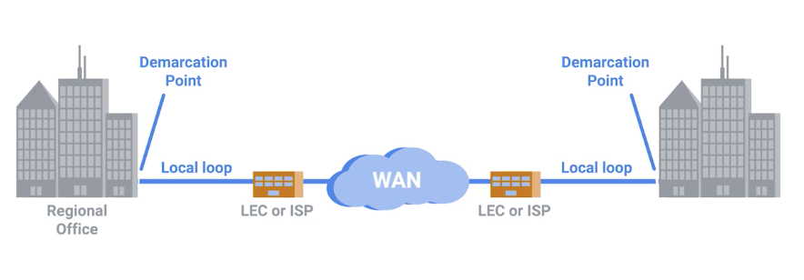
- use multiple data link layer protocols

#### Point-to-Point VPNs

- 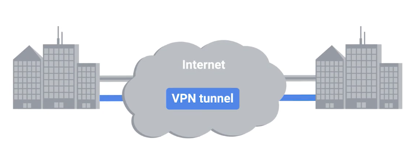
  - the VPN tuneling logic is handle by network devices at either side so the users don't all have to establish their own connections.

### Wireless Networking

#### Introduction

- IEEE802.11 family - WiFi
- Frequency band - a certain section of the radio spectrum that's been agreed upon to be used for certain communications
- both physical and data link layer
  - different versions operate bacially the same at data link layer but varies at physical layer, such as different modulation, different transmission bit rates, different frequency bands
- Wireless access point - a device that bridges the wireless and wired portions of a network
- A 802.11 frame
  - 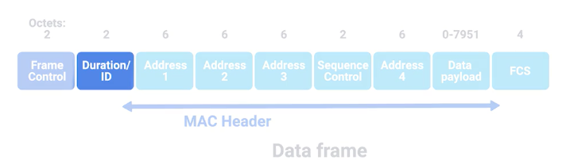
  - Frame Control - 16 bits, contains a number of sub-fields that describe frame itself, e.g. the version of 802.11
  - Duration / ID - how long the frame is
  - Address 1 - normal source address - MAC address of sending device - 48 bits
  - Address 2 - intended destination on the network
  - Address 3 - receiver address - MAC address of the access point that should receive the frame
  - Sequence Control - 16 bits - sequence number used to keep track of ordering the frames
  - Address 4 - transmitter address - MAC address of whatever has just transmitted the frame
  - Data payload
  - FCS

#### Wireless Network Configuration

- Ad-hoc network - all node speak directly to each other

  - no network supporting infrastructure
  - all nodes help pass along messages
  - use case, warehouse, disaster situation

- WLANS (Wireless LANs) - bridge wireless and wired network

  - 

- Mesh networks - hybrid of above two

  - 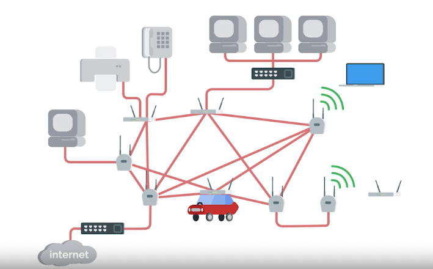

    

  

#### Wireless Channels

- individual, smaller section of the overall frequency band used by a wireless network
- 2.4 G  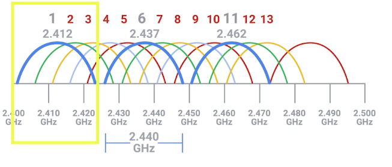
- normally access points perform congestion analysis, and dynamically change their channels
- overlapping channels - collision domains

#### Wireless Security

- Wired Equivalent Privacy (WEP) - An encryption technology that provides a very low level of privacy
  - use 40 bits key to encrypt the data
- WPA - WiFi protected access
  - 128 bits key
- WPA2 
  - 256 bits key
- MAC filtering - you configure your access points to only allow for connections from a specific set of MAC addresses belonging to devices you trust

#### Cellular Networking

- longer distance
- each cell is assigned a specific frequency band for use and neighboring cells are set up to use bands that don't overlap

### Verifying Connectivity

#### Ping: Internet Control Message Protocol

- ICMP - internet control message protocol - mainly used by router or remote hosts to communicate while transmission has failed back to the origin of the transmission.
  - network layer
  - 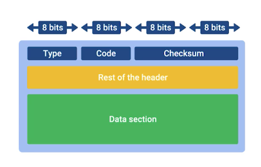
  - Type - 8 bits - type of delivered message, e.g. destination unreachable or time exceeded
  - Code - 8 bits - more specific reason - e.g. destionation network unreachable or destination prot  unreachable
  - Checksum
  - Rest of the header - 32 bits - used by some of th specific types/codes to send more data
  - Data section - contains entire IP header and first eight bytes of the data payload section of th eoffending packet.
- Ping - send a special type of ICMP message called an Echo Request
  - if the destination is up and running and able to communication on the network, it'll send back an ICMP Echo Reply message type

#### Traceroute

- a utility that lets you discover the path between two nodes, and gives you information about each hop along the way
  - traceroute sends packets with different ttl(start with 1 and increment it until reach the destination)
- mtr / pathping

#### Testing Port Connectivity

- netcat (`nc`) - mac/linux, Test-NetConnection (``) - windows

### Digging into DNS

#### Name Resolution Tools

- nslookup

#### Public DNS Servers

- public Level 3 DNS servers - 4.2.2.1 to 4.2.2.6
- google - 8.8.8.8, 8.8.4.4

#### DNS Registration and Expiration

- 

#### Hosts Files

- the orginal way that numbered network addresses were corelated with words was through hosts files
- a flat file that contains, on each line, a network address followed by the host name it can be referred to as
- loopback address - a way of sending network traffic to itself
  - 127.0.0.1
  - hostfile example  127.0.0.1 localhost
  - IPv6 -  `::1`

### The Cloud

#### What is The Cloud?

- cloud computing - a technological approach where computing resources are provisioned in a shareable way, so that lots of users get what they need, when they need it
- Virtualization - a single physical machine, called a host, could run many individual virtual instances, called guests
- hypervisor - a piece of software that run and manages virtual machines, while also offering these guests a virtual operating platform that's indistinguishable from actual hardware

#### Everything as a Service

- X as a service
  - IaaS - Infrastructure as a service - provide hardware, network for customers
  - PssS - Platform as a Service - a subset of cloud computing where a platform(like a web server) is provided for customers to run their services
  - SaaS - Software as a Service - licensing the use of software to others while keeping that software centrally hosted and managed

#### Cloud Storage

- provide customers with storage to probably along with services, such as security, accessibility, flexibility

### IPv6

#### IPv6 Addressing and Subnetting

- 128 bits - 2001:0db8:0000:0000:0000:ff00:0012:3456
- shortening rules
  - you can remove any leading zeros from a group - 2001:0db8:0:0:0:ff00:0012:345
  - any number of consecutive groups composed of just zeros can be replaces with two colons - 2001:0db8::ff00:0012:345
- some reserved ranges
  - ::1 - loopback address (localhost)
  - 2001:0db8 - documentation/education
  - FF00:: - multicast - addressing groups of hosts all at once
  - FF80:: - link-local unicast - allow for local network segment communicaitons and are configured based upon a host's MAC address.
- similar subneeting technique of IPv6

#### IPv6 Headers

- 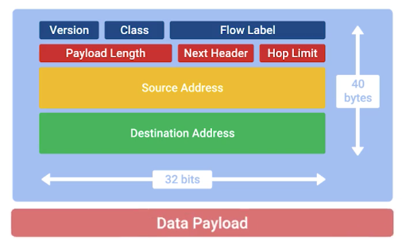
  - version - 4 bits - version of ip
  - class - 8 bits - traffic class - type of traffic contained within the IP datagram and allows for different classes of traffic to receive different priorities.
  - flow label - 20 bits - used in conjunction with traffic class for routers to decide the 
  - playload length - 16 bits - length of data payload
  - next header - 8 bits  - what kinds of header is immediately after current one
  - hop limit - 8 bits - TTL 

#### IPv6 and IPv4 Harmony

- IPv4 mapped address space
  - 0:0:0:0:0:fffff:     -   e.g.  192.168.1.1 = ::fffff:d1ad:35a7
- IPv6 tunnels - Servers take incoming IPv6 traffic and encapsulate it within traditional IPv4 datagram
  - used for IPv6 datagram to be delivered across IPv4 internet space - encapsulation / decapsulation 
- IPV6 tunnel broker - companies that provide IPv6 tunneling endpoints for you so you don't have to introduce additional equipment to your network


